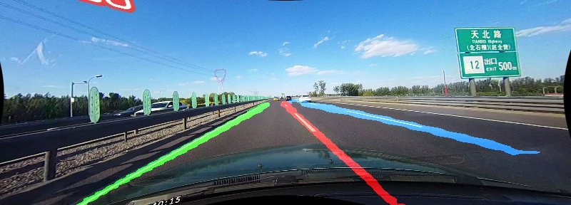

# LaneNet lane detection in Pytorch

LaneNet is a segmentation-tasked lane detection algorithm, described in [1] "[Towards end-to-end lane detection: an instance segmentation approach](https://arxiv.org/pdf/1802.05591.pdf)" . The key idea of instance segmentation should be referred to [2] "[Semantic instance segmentation with a discriminative loss function](https://arxiv.org/pdf/1708.02551.pdf)". This repository contains a re-implementation in Pytorch.

### News
- Codebase would be updated these days. There are many bugs currently in this repo. Sorry for the late response. 


## Data preparation

### CULane

The dataset is available in [CULane](https://xingangpan.github.io/projects/CULane.html). Please download and unzip the files in one folder, which later is represented as `CULane_path`.  Then modify the path of `CULane_path` in `config.py`.
```
CULane_path
├── driver_100_30frame
├── driver_161_90frame
├── driver_182_30frame
├── driver_193_90frame
├── driver_23_30frame
├── driver_37_30frame
├── laneseg_label_w16
├── laneseg_label_w16_test
└── list
```

**Note: absolute path is encouraged.**


### Tusimple
The dataset is available in [here](https://github.com/TuSimple/tusimple-benchmark/issues/3). Please download and unzip the files in one folder, which later is represented as `Tusimple_path`. Then modify the path of `Tusimple_path` in `config.py`.
```
Tusimple_path
├── clips
├── label_data_0313.json
├── label_data_0531.json
├── label_data_0601.json
└── test_label.json
```

**Note:  seg\_label images and gt.txt, as in CULane dataset format,  will be generated the first time `Tusimple` object is instantiated. It may take time.**


## Demo Test

For single image demo test:

```Bash
python demo_test.py -i demo/demo.jpg 
                    -w path/to/weight
                    -b 1.5
                    [--visualize / -v]
```

An untested model can be downloaded [here].  (It will be uploaded soon.)



## Train 

1. Specify an experiment directory, e.g. `experiments/exp0`.  Assign the path to variable `exp_dir` in `train.py`.

2. Modify the hyperparameters in `experiments/exp0/cfg.json`.

3. Start training:

   ```python
   python train.py [-r]
   ```

4. Monitor on tensorboard:

   ```
   tensorboard --logdir='experiments/exp0' > experiments/exp0/board.log 2>&1 &
   ```

**Note**


- My model is trained with `torch.nn.DataParallel`. Modify it according to your hardware configuration.


## Reference

[1]. Neven, Davy, et al. "[Towards end-to-end lane detection: an instance segmentation approach.](https://arxiv.org/pdf/1802.05591.pdf)" *2018 IEEE Intelligent Vehicles Symposium (IV)*. IEEE, 2018.

[2]. De Brabandere, Bert, Davy Neven, and Luc Van Gool. "[Semantic instance segmentation with a discriminative loss function.](https://arxiv.org/pdf/1708.02551.pdf)" *arXiv preprint arXiv:1708.02551* (2017).

